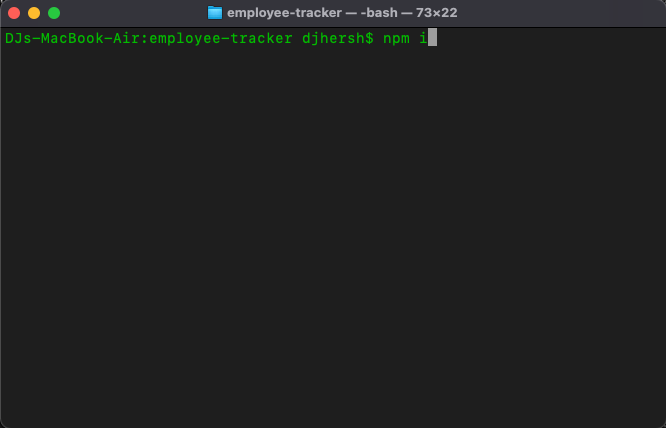
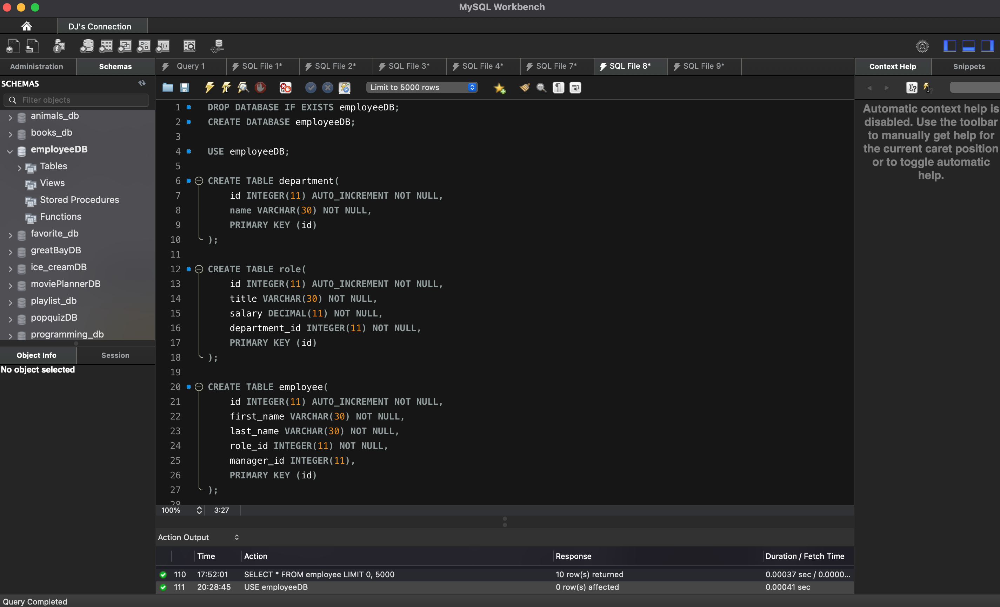

# Employee Database Tracker

## Description

This is an application that allows the user to create, update, read, and delete information from a database of employees. It uses MySQL to create the database, as well as the npm package mysql to connect and interact with the data. It utilizes the npm package Inquirer to allow for user interaction.

## Table of Contents

* [Usage](#usage)
* [Credits](#credits)
* [Questions](#questions)
* [License](#license)

## Usage

First, you must install the npm packages inquirer and mysql. If you have cloned this repository, then simply navigate to the root directory in your terminal, type 'npm i', and hit enter.

Once you have downloaded the packages, you will need to copy and paste the schema.sql and seed.sql files into MySQL Workbench. 

Once you have done this, go to the employeeDB.js file and update the mysql create connection object with your MySQL Workbench password. Now you are ready to use the CLI. Navigate to the root directory in your terminal, type 'node employeeDB.js', and hit enter. 

[Click here for a video demonstration of the app](https://drive.google.com/file/d/1oQ6W52cbJriPgfovIs7WEEZ2GwtK6W8r/view)

## Credits

First I must credit the UCLA Extension Full-Stack Web Development Coding Bootcamp, instructor Bryan Swarthout, and TA Wilson Lam for providing me with all of the tools and knowledge I used to build this application.

http://www.uclaextension.edu

MySQL Workbench was used to create the database.

https://www.mysql.com/products/workbench/

The npm packages 'mysql' was used to connect and interact with the database.

https://www.npmjs.com/package/mysql

The npm package 'Inquirer' was used to allow the user to interact with the data.

https://www.npmjs.com/package/inquirer

The npm package 'console.table' was used for formatting data in the terminal

https://www.npmjs.com/package/console.table

## Questions

For any questions, I, DJ Hersh, can be contacted via email at DanielJHersh@gmail.com

My GitHub profile is located at https://github.com/DJ620

## License

MIT License

Copyright (c) [2020] [DJ Hersh]

Permission is hereby granted, free of charge, to any person obtaining a copy
of this software and associated documentation files (the "Software"), to deal
in the Software without restriction, including without limitation the rights
to use, copy, modify, merge, publish, distribute, sublicense, and/or sell
copies of the Software, and to permit persons to whom the Software is
furnished to do so, subject to the following conditions:

The above copyright notice and this permission notice shall be included in all
copies or substantial portions of the Software.

THE SOFTWARE IS PROVIDED "AS IS", WITHOUT WARRANTY OF ANY KIND, EXPRESS OR
IMPLIED, INCLUDING BUT NOT LIMITED TO THE WARRANTIES OF MERCHANTABILITY,
FITNESS FOR A PARTICULAR PURPOSE AND NONINFRINGEMENT. IN NO EVENT SHALL THE
AUTHORS OR COPYRIGHT HOLDERS BE LIABLE FOR ANY CLAIM, DAMAGES OR OTHER
LIABILITY, WHETHER IN AN ACTION OF CONTRACT, TORT OR OTHERWISE, ARISING FROM,
OUT OF OR IN CONNECTION WITH THE SOFTWARE OR THE USE OR OTHER DEALINGS IN THE
SOFTWARE.